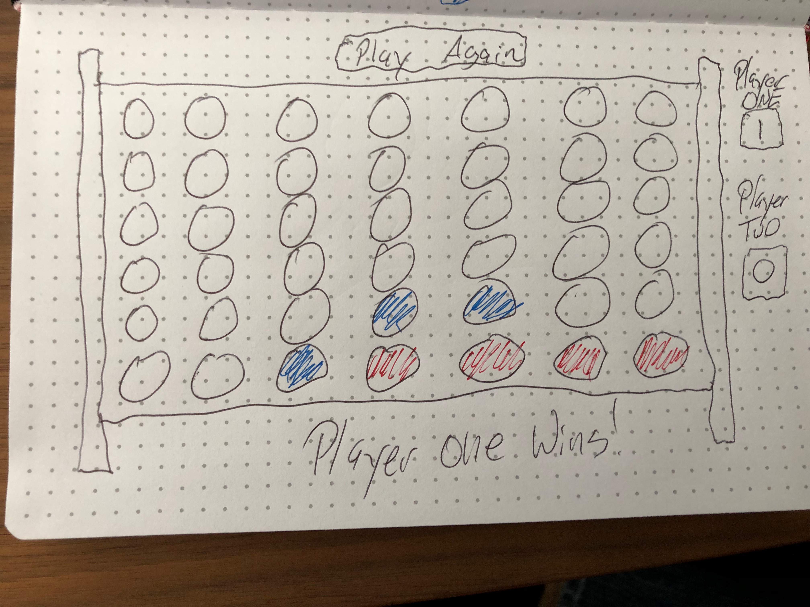

# CONNECT FOUR

## Overview

Connect four is a two person game where players drop tokens into the game board and try to get four in a row

## Game Rules

* Click the "Start Game" button 
* Players enter their name
* Players alternate turns dropping tokens into game board
* Game is won if either player connects four tokens vertically, horizontally, or diagonally

## Wireframes

## Technologies Used

* Languages ==> HTML | CSS | Javascript
* Libraries ==> JQuery | 

## Stretch Goals